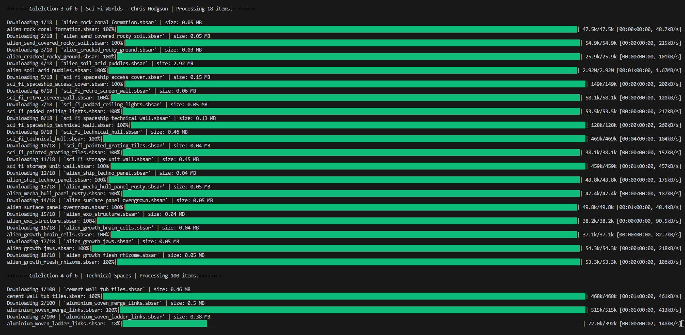
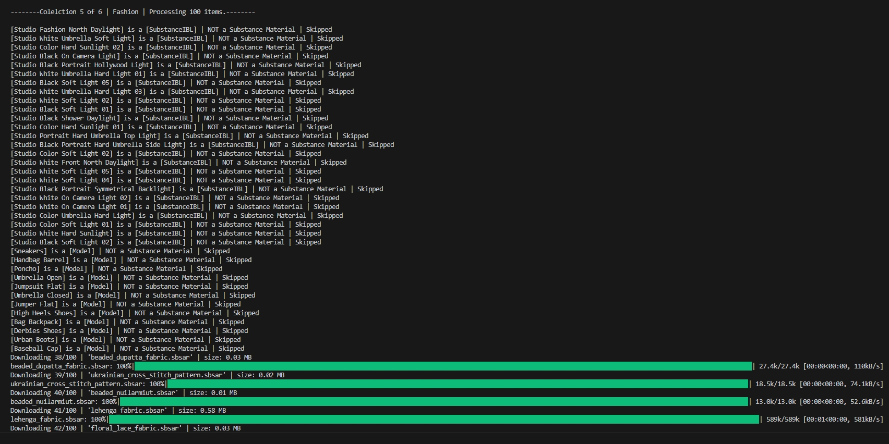

# Substance Assets Downloader

This tool allows you to batch download Substance 3D materials from any collections using the official GraphQL endpoint. It handles authentication, checks for existing purchases, and organizes downloads into collection-named folders.

## Features

- Downloads assets from specified Adobe Substance collections
- Verifies and purchases assets if not already owned
- Only downloads materials in Substance format (.sbsar)
- Organizes files by collection name

## Requirements

- Access to the Adobe Substance Library (Adobe Subscription)
- Valid IMS session ID
- Collection ID

# Usage

### Clone the repository:

```bash
git clone https://github.com/your-username/substance-assets-batch-downloader.git
cd substance-assets-batch-downloader
```
### Install Dependencies:

```bash
pip install -r requirements.txt
```

### Update config.py:

Navigate to config.py for more info about it.

### Run:

```bash
python main.py
```

## Screenshots



